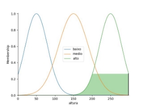

Integrantes:

Eduardo Antunes Vicente RA: 22.121.010-7 Ana Jéssica Soares da Silva RA: 22.121.100-6

Código:

O código a seguir solicita ao usuário que insira sua altura em centímetros e seu peso em quilogramas. Além disso, pede que classifique seu nível de sedentarismo em uma escala de 0 a 10, onde 0 indica uma pessoa muito ativa e 10 indica alguém que não pratica nenhum tipo de exercício. Da mesma forma, solicita uma classificação de 0 a 10 para o nível de qualidade das refeições, onde 0 representa refeições compostas por alimentos prejudiciais à saúde e 10 indica uma refeição saudável e equilibrada.

saídas para diferentes tipos de função:

Para ter melhores parâmetros de comparação foram usadas os mesmos valores de entrada Parâmetros de entrada:

altura: 170 Peso: 85 Sedentarismo: 6 Alimentacao: 8

Triangular:

|  |  |
| ---------------------------------------------------------------------- | ---------------------------------------------------------------------- |

|  |  |
| ---------------------------------------------------------------------- | ---------------------------------------------------------------------- |

Saída:

altura: 170 Peso: 85 Sedentarismo: 6![ref1]

Alimentacao: 8

Grau de obesidade: 50.00

Gaussiana:

|  |  |
| ---------------------------------------------------------------------- | ---------------------------------------------------------------------- |
|  |  |

Saída:

altura: 170![ref2]

Peso: 85

Sedentarismo: 6 Alimentacao: 8

Grau de obesidade: 49.99

Trapezoidal:

|  |  |
| ---------------------------------------------------------------------- | ---------------------------------------------------------------------- |
|  |  |

Saída:

altura: 170![ref2]

Peso: 85

Sedentarismo: 6 Alimentacao: 8

Grau de obesidade: 50.00

Análise de sensibilidade entre as variáveis Menor Valor x Valor Intermediário X Maior Valor

Menor Valor:

Parâmetros de entrada:

altura: 0

Peso: 0 Sedentarismo: 0 Alimentacao: 0

|  |  |
| ---------------------------------------------------------------------- | ---------------------------------------------------------------------- |
|  |  |

Saída:

altura: 0

Peso: 0

Sedentarismo: 0 Alimentacao: 0

Grau de obesidade: 49.99

Valor Intermediário

Parâmetros de entrada:

altura: 149![ref1]

Peso: 99

Sedentarismo: 5 Alimentacao: 5

Grau de obesidade: 49.90

|  |  |
| ---------------------------------------------------------------------- | ---------------------------------------------------------------------- |
|  |  |

Saída:

altura: 149

Peso: 99

Sedentarismo: 5 Alimentacao: 5

Grau de obesidade: 49.90

Maior Valor

Parâmetros de entrada:

altura: 299![ref3]

Peso: 199 Sedentarismo: 10 Alimentacao: 10

|  |  |
| ---------------------------------------------------------------------- | ---------------------------------------------------------------------- |
|  |  |

Saída:

altura: 299

Peso: 199

Sedentarismo: 10 Alimentacao: 10

Grau de obesidade: 50.00

Comparação entre modelos com a variável Obesidade:

Parâmetros de entrada:

altura: 170 Peso: 85 Sedentarismo: 6 Alimentacao: 8![ref3]

Triangular:

Gaussiana:

Trapezoidal:

Experiência com o problema e exemplo de aplicação:

Foi desenvolvido um sistema que utiliza parâmetros como altura, peso, nível de sedentarismo e qualidade das refeições do usuário para calcular e classificar o grau de obesidade. Uma das principais dificuldades enfrentadas durante o desenvolvimento foi o ajuste manual dos intervalos de valores das variáveis para cada tipo de função de pertinência, como "trimf", "gaussmf" e "trapmf". Outro desafio significativo foi a formulação das regras do algoritmo. Foi necessário criar um conjunto abrangente de regras que permitisse ao sistema classificar o grau de obesidade em cinco categorias distintas: inexistente, baixo, médio, alto e extremo.

Código:

import numpy as np

import skfuzzy as fuzz

import matplotlib.pyplot as plt from skfuzzy import control as ctrl

grafico = int(input("Insira o tipo de grafico que deseja: \n1 - Triangulo\n2 - Trapezio\n3 - Gaussiana\n4 - Automatico \nTipo de grafico: "))

- Variaveis antecedentes

altura = ctrl.Antecedent(np.arange(0, 300, 1), 'altura')

peso = ctrl.Antecedent(np.arange(0, 200, 1), 'peso')

sedentarismo = ctrl.Antecedent(np.arange(0, 11, 1), 'sedentarismo') alimentacao = ctrl.Antecedent(np.arange(0, 11, 1), 'alimentacao')

#Variaveis conseguente

obesidade = ctrl.Consequent(np.arange(0, 100, 1), 'obesidade')

def automatico():

- automf -> Atribuição de categorias automaticamente altura.automf(names=['baixo','medio','alto'],) peso.automf(names=['baixo','medio','alto']) sedentarismo.automf(names=['baixo','medio','alto']) alimentacao.automf(names=['baixo','medio','alto'])

obesidade.automf(names=['inexistente', 'baixo', 'medio', ![ref4]'alto', 'extremo'])

def triangulo():

- Funções Triangulo

altura['baixo'] = fuzz.trimf(altura.universe, [0, 50, 100]) altura['medio'] = fuzz.trimf(altura.universe, [50, 100, 150]) altura['alto'] = fuzz.trimf(altura.universe, [100, 150, 300])

peso['baixo'] = fuzz.trimf(peso.universe, [0, 80, 100]) peso['medio'] = fuzz.trimf(peso.universe, [80, 100, 140]) peso['alto'] = fuzz.trimf(peso.universe, [100, 140, 200])

sedentarismo['baixo'] = fuzz.trimf(sedentarismo.universe, [0, 2, 4])

sedentarismo['medio'] = fuzz.trimf(sedentarismo.universe, [2, 4, 7])

sedentarismo['alto'] = fuzz.trimf(sedentarismo.universe, [4, 7, 10])

alimentacao['baixo'] = fuzz.trimf(alimentacao.universe, [0, 3, 6])

alimentacao['medio'] = fuzz.trimf(alimentacao.universe, [3, 6, 8])

alimentacao['alto'] = fuzz.trimf(alimentacao.universe, [6, 8, 10])

obesidade['inexistente'] = fuzz.trimf(obesidade.universe, [0, 0, 25])

obesidade['baixo'] = fuzz.trimf(obesidade.universe, [0, 25, 50])

obesidade['medio'] = fuzz.trimf(obesidade.universe, [25, 50, 75])

obesidade['alto'] = fuzz.trimf(obesidade.universe, [50, 75, 100])

obesidade['extremo'] = fuzz.trimf(obesidade.universe, [75, 100, 100])

def gaugasiana():

- Funções gaussianas

altura['baixo'] = fuzz.gaussmf(altura.universe, 50, 30) ![ref4]altura['medio'] = fuzz.gaussmf(altura.universe, 150, 40) altura['alto'] = fuzz.gaussmf(altura.universe, 250, 30)

peso['baixo'] = fuzz.gaussmf(peso.universe, 70, 20) peso['medio'] = fuzz.gaussmf(peso.universe, 120, 30) peso['alto'] = fuzz.gaussmf(peso.universe, 170, 20)

sedentarismo['baixo'] = fuzz.gaussmf(sedentarismo.universe, 2, 1)

sedentarismo['medio'] = fuzz.gaussmf(sedentarismo.universe, 6, 2)

sedentarismo['alto'] = fuzz.gaussmf(sedentarismo.universe, 9, 1)

alimentacao['baixo'] = fuzz.gaussmf(alimentacao.universe, 3, 1)

alimentacao['medio'] = fuzz.gaussmf(alimentacao.universe, 7, 2)

alimentacao['alto'] = fuzz.gaussmf(alimentacao.universe, 9, 1) obesidade['inexistente'] = fuzz.gaussmf(obesidade.universe,

10, 5)

obesidade['baixo'] = fuzz.gaussmf(obesidade.universe, 30, 10) obesidade['medio'] = fuzz.gaussmf(obesidade.universe, 50, 10) obesidade['alto'] = fuzz.gaussmf(obesidade.universe, 70, 10) obesidade['extremo'] = fuzz.gaussmf(obesidade.universe, 90, 5)

def trapezoidais():

- Funções trapezoidais

altura['baixo'] = fuzz.trapmf(altura.universe, [0, 0, 50,

100])

altura['medio'] = fuzz.trapmf(altura.universe, [50, 100, 150, 200])

altura['alto'] = fuzz.trapmf(altura.universe, [150, 200, 250, 300])

peso['baixo'] = fuzz.trapmf(peso.universe, [0, 0, 50, 100]) peso['medio'] = fuzz.trapmf(peso.universe, [50, 100, 150,

200])

peso['alto'] = fuzz.trapmf(peso.universe, [150, 200, 250,![ref4]

300])

sedentarismo['baixo'] = fuzz.trapmf(sedentarismo.universe, [0, 0, 3, 5])

sedentarismo['medio'] = fuzz.trapmf(sedentarismo.universe, [3, 5, 6, 8])

sedentarismo['alto'] = fuzz.trapmf(sedentarismo.universe, [6, 8, 10, 10])

alimentacao['baixo'] = fuzz.trapmf(alimentacao.universe, [0, 0, 3, 5])

alimentacao['medio'] = fuzz.trapmf(alimentacao.universe, [3, 5, 6, 8])

alimentacao['alto'] = fuzz.trapmf(alimentacao.universe, [6, 8, 10, 10])

obesidade['inexistente'] = fuzz.trapmf(obesidade.universe, [0, 0, 10, 20])

obesidade['baixo'] = fuzz.trapmf(obesidade.universe, [10, 20, 30, 50])

obesidade['medio'] = fuzz.trapmf(obesidade.universe, [30, 50, 50, 70])

obesidade['alto'] = fuzz.trapmf(obesidade.universe, [50, 70,

80, 90])

obesidade['extremo'] = fuzz.trapmf(obesidade.universe, [80, 90, 100, 100])

if grafico == 1:

triangulo() elif grafico == 2:

trapezoidais() elif grafico == 3:

gaugasiana() elif grafico == 4:

automatico()

else:

print("Opção inválida. Escolha um número de 1 a 4 para o tipo

de gráfico.")

exit(1)

#Visualizando as variáveis

altura.view() ![ref4]peso.view() sedentarismo.view() alimentacao.view() obesidade.view()

#Criando as regras

regra_1 = ctrl.Rule(altura['baixo'] & peso['baixo'] & sedentarismo['alto'] & alimentacao['medio'], obesidade['medio']) regra_2 = ctrl.Rule(altura['medio'] & peso['medio'] & sedentarismo['medio'] & alimentacao['medio'], obesidade['medio']) regra_3 = ctrl.Rule(altura['alto'] & peso['alto'] & sedentarismo['baixo']& alimentacao['baixo'], obesidade['medio'])

regra_4 = ctrl.Rule(altura['alto'] & peso['alto'] & sedentarismo['alto'] & alimentacao['baixo'], obesidade['extremo']) regra_5 = ctrl.Rule(altura['baixo'] & peso['alto'] & sedentarismo['baixo'] & alimentacao['baixo'], obesidade['medio']) regra_6 = ctrl.Rule(altura['alto'] & peso['baixo'] & sedentarismo['baixo'] & alimentacao['alto'], obesidade['inexistente'])

regra_7 = ctrl.Rule(altura['alto'] & peso['baixo'] & sedentarismo['baixo'] & alimentacao['medio'], obesidade['baixo']) regra_8 = ctrl.Rule(altura['alto'] & peso['medio'] & alimentacao['alto'] & sedentarismo['medio'], obesidade['medio']) regra_9 = ctrl.Rule(altura['medio'] & peso['medio'] & alimentacao['alto'] & sedentarismo['medio'], obesidade['medio']) regra_10 = ctrl.Rule(altura['alto'] & peso['medio'] & alimentacao['alto'] & sedentarismo['baixo'], obesidade['medio']) regra_11 = ctrl.Rule(sedentarismo['alto'] & alimentacao['baixo'], obesidade['extremo'])

regra_12 = ctrl.Rule(altura['alto'] & alimentacao['baixo'], obesidade['medio'])

regra_13 = ctrl.Rule(peso['baixo'] & sedentarismo['alto'], obesidade['medio'])

controlador = ctrl.ControlSystem([regra\_1, regra\_2, regra\_3, regra\_4, regra\_5, regra\_6, regra\_7, regra\_8, regra\_9, regra\_10, regra\_11, regra\_12, regra\_13])

#Simulando![ref4]

CalculoObesidade = ctrl.ControlSystemSimulation(controlador)

notaAltura = int(input('Altura(Cm): '))

notaPeso = int(input('peso(Kg): '))

notaSedentarismo = int(input('De 0 a 10 qual seu nivel de sedentarismo: '))

notaAlimentacao = int(input('De 0 a 10 qual a qualidade de suas refeicoes: '))

- notaAltura = 170
- notaPeso = 85
- notaSedentarismo = 6
- notaAlimentacao = 8

CalculoObesidade.input['altura'] = notaAltura CalculoObesidade.input['peso'] = notaPeso CalculoObesidade.input['sedentarismo'] = notaSedentarismo CalculoObesidade.input['alimentacao'] = notaAlimentacao

CalculoObesidade.compute()

valorObesidade = CalculoObesidade.output['obesidade']

print("\naltura: %d \nPeso: %d \nSedentarismo: %d \nAlimentacao: %d \nGrau de obesidade: %5.2f" %(

notaAltura,

notaPeso,

notaSedentarismo,

notaAlimentacao,

valorObesidade

))

altura.view(sim=CalculoObesidade) peso.view(sim=CalculoObesidade) sedentarismo.view(sim=CalculoObesidade)

alimentacao.view(sim=CalculoObesidade) obesidade.view(sim=CalculoObesidade) plt.show()

[ref1]: images/Aspose.Words.9a30bfb9-9c6f-49bb-9fb9-7bf453aec3b2.007.png
[ref2]: images/Aspose.Words.9a30bfb9-9c6f-49bb-9fb9-7bf453aec3b2.013.png
[ref3]: images/Aspose.Words.9a30bfb9-9c6f-49bb-9fb9-7bf453aec3b2.030.png
[ref4]: images/Aspose.Words.9a30bfb9-9c6f-49bb-9fb9-7bf453aec3b2.040.png
