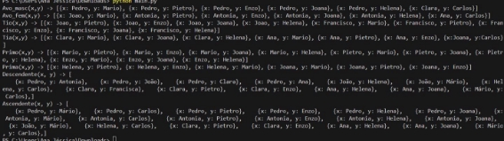

Ana Jéssica Soares da Silva      R.A.:22.121.100-6  Eduardo Antunes Vicente          R.A.: 22.121.010-7 

Resultado: 

Codigo: 

- pip install aima3 

from aima3.logic import expr,FolKB, fol\_fc\_ask 

clauses = [] 

clauses.append(expr("Progenitor(Antonia,Joao)")) clauses.append(expr("Progenitor(Pedro,Joao)")) clauses.append(expr("Progenitor(Antonia,Clara)")) clauses.append(expr("Progenitor(Pedro,Clara)")) clauses.append(expr("Progenitor(Antonia,Francisco)")) clauses.append(expr("Progenitor(Pedro,Francisco)")) clauses.append(expr("Progenitor(Antonia,Ana)")) clauses.append(expr("Progenitor(Pedro,Ana)")) 

clauses.append(expr("Progenitor(Ana,Helena)")) clauses.append(expr("Progenitor(Ana,Joana)")) 

clauses.append(expr("Progenitor(Joao,Mario)")) 

clauses.append(expr("Progenitor(Helena2,Carlos)")) clauses.append(expr("Progenitor(Mario,Carlos)")) 

clauses.append(expr("Progenitor(Clara,Pietro)")) clauses.append(expr("Progenitor(Clara,Enzo)")) 

clauses.append(expr("Progenitor(x,y) ==> Pessoa(x)")) clauses.append(expr("Progenitor(x,y) ==> Pessoa(y)")) 

clauses.append(expr("Casado(Francisco,Milene)")) clauses.append(expr("Casado(Milene,Francisco)")) 

clauses.append(expr("Casado(Pietro,Francisca)")) clauses.append(expr("Casado(Enzo,Antonia2)")) clauses.append(expr("Casado(x,y) ==> Pessoa(x)")) clauses.append(expr("Casado(x,y) ==> Pessoa(y)")) 

clauses.append(expr("Sexo(Antonia,Feminino)")) clauses.append(expr("Sexo(Pedro,Masculino)")) clauses.append(expr("Sexo(Joao,Masculino)")) clauses.append(expr("Sexo(Clara,Feminino)")) clauses.append(expr("Sexo(Francisco,Masculino)")) clauses.append(expr("Sexo(Ana,Feminino)")) clauses.append(expr("Sexo(Helena,Feminino)")) clauses.append(expr("Sexo(Joana,Feminino)")) clauses.append(expr("Sexo(Mario,Masculino)")) clauses.append(expr("Sexo(Milene,Feminino)")) clauses.append(expr("Sexo(Carlos,Masculino)")) clauses.append(expr("Sexo(Pietro,Masculino)")) clauses.append(expr("Sexo(Enzo,Masculino)")) clauses.append(expr("Sexo(Francisca,Feminino)")) clauses.append(expr("Sexo(Antonia2,Feminino)")) 

clauses.append(expr("Progenitor(x,y) ==> Descendente(y,x)")) clauses.append(expr("Progenitor(x,y) ==> Ascendente(x,y)")) 

clauses.append(expr("Progenitor(x,y) & Sexo(x,Masculino) ==> Pai(x,y) ")) clauses.append(expr("Progenitor(x,y) & Sexo(x,Feminino) ==> Mae(x,y) ")) 

clauses.append(expr("Progenitor(x,y) & Progenitor(x,z) & Sexo(y,Masculino) ==> Irmao(y,z)")) 

clauses.append(expr("Progenitor(x,y) & Progenitor(x,z) & Sexo(y,Feminino) ==> Irma(y,z)")) 

clauses.append(expr("Progenitor(x,y) & Progenitor(y,z) & Sexo(x,Masculino) ==> Avo\_masc(z,x)")) clauses.append(expr("Progenitor(x,y) & Progenitor(y,z) & Sexo(x,Feminino) ==> Avo\_fem(z,x)")) 

clauses.append(expr("Progenitor(x,y) & Irmao(x,z) & Progenitor(z,w) ==> Tio(x,w)")) 

clauses.append(expr("Progenitor(x,y) & Irma(x,z) & Progenitor(z,w) ==> 

Tia(x,w)")) 

clauses.append(expr("Progenitor(x,y) & Irmao(z,x) & Progenitor(w,v) & Irmao(w,z) ==> Primo(x,v)")) 

clauses.append(expr("Progenitor(x,y) & Irma(z,x) & Progenitor(w,v) & Irmao(w,z) ==> Prima(x,v)")) 

Genealogia = FolKB(clauses) 

foto do perfil 

quando eu coloco esse codigo para rodar ele não faz naada  

- pip install aima3 

from aima3.logic import expr,FolKB, fol\_fc\_ask 

clauses = [] 

clauses.append(expr("Progenitor(Antonia,Joao)")) clauses.append(expr("Progenitor(Pedro,Joao)")) clauses.append(expr("Progenitor(Antonia,Clara)")) clauses.append(expr("Progenitor(Pedro,Clara)")) clauses.append(expr("Progenitor(Antonia,Francisco)")) clauses.append(expr("Progenitor(Pedro,Francisco)")) clauses.append(expr("Progenitor(Antonia,Ana)")) clauses.append(expr("Progenitor(Pedro,Ana)")) 

clauses.append(expr("Progenitor(Ana,Helena)")) clauses.append(expr("Progenitor(Ana,Joana)")) 

clauses.append(expr("Progenitor(Joao,Mario)")) 

clauses.append(expr("Progenitor(Helena,Carlos)")) clauses.append(expr("Progenitor(Mario,Carlos)")) 

clauses.append(expr("Progenitor(Clara,Pietro)")) clauses.append(expr("Progenitor(Clara,Enzo)")) 

clauses.append(expr("Progenitor(x,y) ==> Pessoa(x)")) clauses.append(expr("Progenitor(x,y) ==> Pessoa(y)")) 

clauses.append(expr("Casado(Francisco,Milene)")) clauses.append(expr("Casado(Milene,Francisco)")) 

clauses.append(expr("Casado(Pietro,Francisca)")) clauses.append(expr("Casado(Enzo,Antonia2)")) 

clauses.append(expr("Casado(x,y) ==> Pessoa(x)")) clauses.append(expr("Casado(x,y) ==> Pessoa(y)")) 

clauses.append(expr("Sexo(Antonia,Feminino)")) clauses.append(expr("Sexo(Pedro,Masculino)")) clauses.append(expr("Sexo(Joao,Masculino)")) clauses.append(expr("Sexo(Clara,Feminino)")) clauses.append(expr("Sexo(Francisco,Masculino)")) clauses.append(expr("Sexo(Ana,Feminino)")) clauses.append(expr("Sexo(Helena,Feminino)")) clauses.append(expr("Sexo(Joana,Feminino)")) clauses.append(expr("Sexo(Mario,Masculino)")) 

clauses.append(expr("Sexo(Milene,Feminino)")) clauses.append(expr("Sexo(Carlos,Masculino)")) clauses.append(expr("Sexo(Pietro,Masculino)")) clauses.append(expr("Sexo(Enzo,Masculino)")) clauses.append(expr("Sexo(Francisca,Feminino)")) clauses.append(expr("Sexo(Antonia2,Feminino)")) 

clauses.append(expr("Progenitor(x,y) ==> Descendente(y,x)")) clauses.append(expr("Progenitor(x,y) ==> Ascendente(x,y)")) 

clauses.append(expr("Progenitor(x,y) & Sexo(x,Masculino) ==> Pai(x,y) ")) clauses.append(expr("Progenitor(x,y) & Sexo(x,Feminino) ==> Mae(x,y) ")) 

clauses.append(expr("Progenitor(x,y) & Progenitor(x,z) & Sexo(y,Masculino) ==> Irmao(y,z)")) 

clauses.append(expr("Progenitor(x,y) & Progenitor(x,z) & Sexo(y,Feminino) ==> Irma(y,z)")) 

clauses.append(expr("Progenitor(x,y) & Progenitor(y,z) & Sexo(x,Masculino) ==> Avo\_masc(z,x)")) clauses.append(expr("Progenitor(x,y) & Progenitor(y,z) & Sexo(x,Feminino) ==> Avo\_fem(z,x)")) 

clauses.append(expr("Progenitor(x,y) & Progenitor(x,z) & Progenitor(z,w) ![ref1]

- Sexo(y,Feminino) ==> Tia(w,y)")) 

clauses.append(expr("Progenitor(x,y) & Progenitor(x,z) & Progenitor(z,w) 

- Sexo(y,Masculino) ==> Tio(w,y)")) clauses.append(expr("Progenitor(x,y) & Progenitor(x,z) & Progenitor(z,w) ![ref1]
- Casado(y,a) & Sexo(a,Feminino) ==> Tia(w,a)")) clauses.append(expr("Progenitor(x,y) & Progenitor(x,z) & Progenitor(z,w) 
- Casado(y,a) & Sexo(a,Masculino) ==> Tio(w,a)")) 

  clauses.append(expr("Progenitor(x,y) & Progenitor(x,z) & Progenitor(z,w) 

- Progenitor(y,c) & Sexo(c,Feminino) ==> Prima(w,c)")) clauses.append(expr("Progenitor(x,y) & Progenitor(x,z) & Progenitor(z,w) 
- Progenitor(y,c) & Sexo(c,Masculino) ==> Primo(w,c)")) 

  Genealogia = FolKB(clauses) 

  perguntas = [ 

  `             `"Avo\_masc(x, y)",              "Avo\_fem(x, y)", 

  `             `"Tio(x, y)", 

  `             `"Tia(x, y)", 

  `             `"Primo(x, y)", 

  `             `"Prima(x, y)", 

  `             `"Descendente(x,y)",              "Ascendente(x,y)" 

] 

for i in perguntas: 

`    `resposta = fol\_fc\_ask(Genealogia, expr(i))     print("%s -> %s" %(i, (list(resposta)))) 

print("FIM") 

[ref1]: images/Aspose.Words.b0631aff-9451-49dd-99a4-43cf19e8d0cd.010.png
